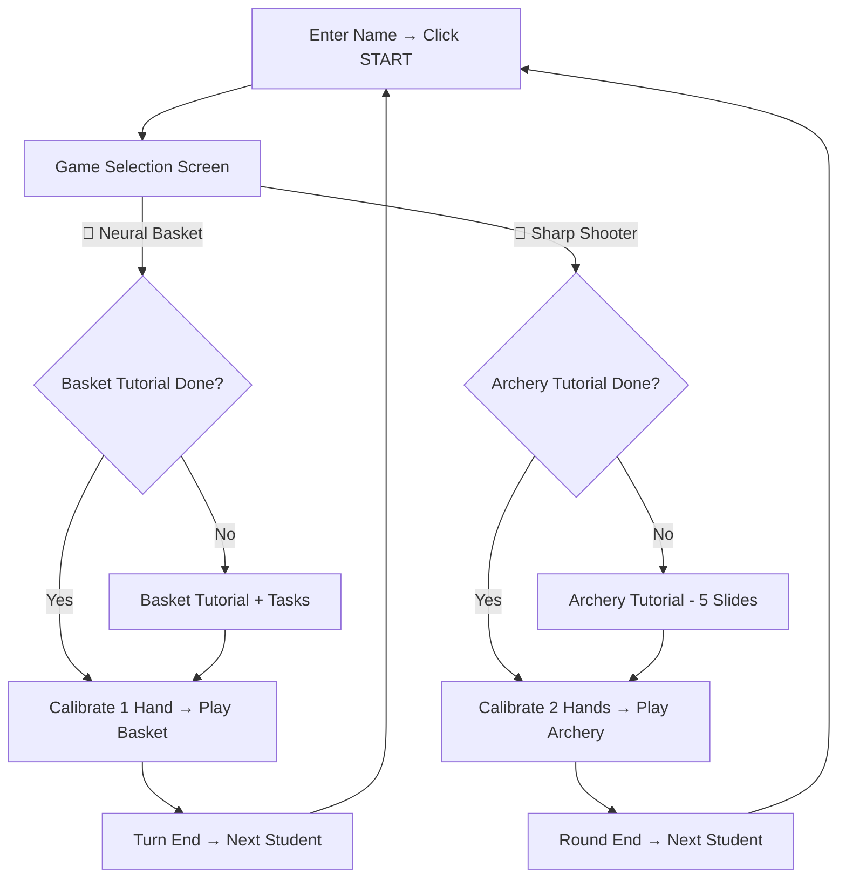

# Sharp Shooter — Archery Game Implementation

## Overview

A complete two-hand archery game **"Sharp Shooter"** has been added as Game 2 alongside the existing Neural Basket game. Players now choose which game to play via a game selection screen.

## Updated Game Flow

## Sharp Shooter Mechanics

### Two-Hand Controls
| Hand | Role | What It Does |
|------|------|-------------|
| **Left hand** (BOW) | Holds the bow, controls aim | Position determines crosshair on target |
| **Right hand** (DRAW) | Pulls bowstring | Distance from bow hand = draw power |

### Stability System ⚡
- Bow hand position is tracked over **25 frames**
- Average movement calculated → **stability score** (0% to 100%)
- Higher stability = tighter aim, less arrow deviation
- HUD shows real-time stability: `ROCK STEADY` → `STEADY` → `SHAKY` → `UNSTABLE!`
- Color-coded meter: 🟢 Green → 🟡 Yellow → 🔴 Red

### Shooting 
1. Show both hands → aim appears on target
2. Pull draw hand **away** from bow hand (distance > 120px = fully drawn)
3. Move draw hand **forward suddenly** (velocity drop > 45px) = **release**
4. Arrow fires toward aim point with **stability-based deviation**
5. Arrow hits target → score calculated by distance from center

### Target Scoring
| Ring | Points | Color |
|------|--------|-------|
| Bullseye ⭐ | **10** | Gold |
| Ring 2 | 9 | Orange |
| Ring 3 | 8 | Pink |
| Ring 4 | 7 | Purple |
| Ring 5 | 6 | Cyan |
| Ring 6 | 5 | Green |
| Outer ring | 1 | Gray |
| Miss | 0 | — |

### Per Student
- **5 arrows** per student
- Max possible score: **50**
- Each shot shows animated popup (🎯 BULLSEYE!, 🔥 GREAT SHOT!, etc.)
- Round end shows shot breakdown grid

## Champion Celebration
When tournament ends, the winner gets:
- 🏆 **SHARP SHOOTER CHAMPION** title
- 🧠 **CONTROLLED MIND** badge (stability mastery)
- 🎯 **SHARP SHOOTER** badge
- 60-emoji confetti rain animation

## Files Changed/Created

| File | Action | Lines |
|------|--------|-------|
| [archery.js](file:///c:/Users/rthsa/OneDrive/Desktop/webcamtrack%20-%20Copy/archery.js) | **NEW** | ~890 lines — Complete archery engine |
| [index.html](file:///c:/Users/rthsa/OneDrive/Desktop/webcamtrack%20-%20Copy/index.html) | Modified | +150 lines — Game select + archery overlays |
| [style.css](file:///c:/Users/rthsa/OneDrive/Desktop/webcamtrack%20-%20Copy/style.css) | Modified | +175 lines — All archery + game select styling |
| [script.js](file:///c:/Users/rthsa/OneDrive/Desktop/webcamtrack%20-%20Copy/script.js) | Modified | +35 lines — Game select flow, 2-hand support, hooks |

## Key Technical Decisions

> [!NOTE]
> `maxNumHands` changed from 1 to 2 in MediaPipe config. The basket game still uses only the first detected hand — no impact on existing gameplay.

> [!IMPORTANT]
> The stability mechanic is the core skill challenge. A perfectly still bow hand results in arrows hitting exactly where the crosshair points. Any trembling adds randomized deviation proportional to the instability.

> [!TIP]
> Each game has independent leaderboards stored in `localStorage`: `neural_basket_lb` for basket, `arch_leaderboard` for archery. Tutorial completion is per-session via `sessionStorage`.
